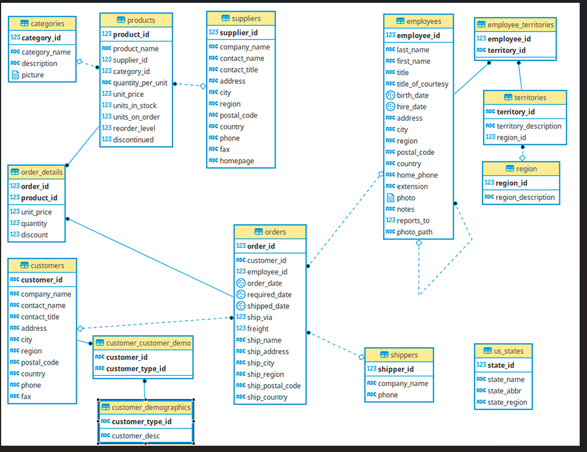
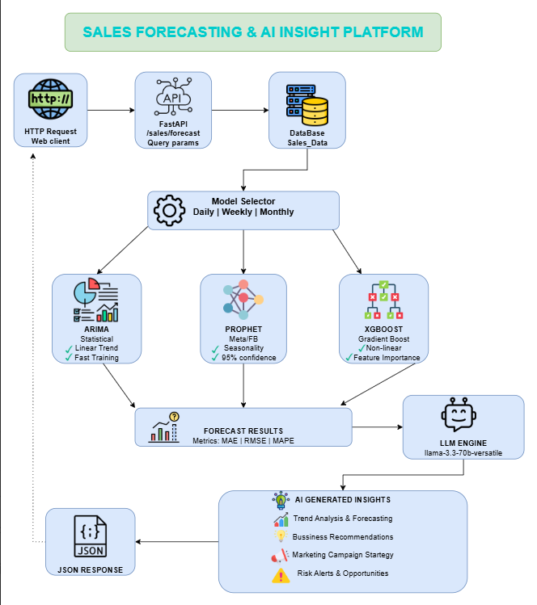

# FastCrate

A modern, opinionated FastAPI boilerplate for building high-performance APIs with best practices out of the box.

## 🚀 Quick Start

```bash
git clone https://github.com/mubashirsidiki/FastCrate.git
cd FastCrate

# Install uv if not already installed
pip install uv

# Install dependencies
uv sync

# To add a new package
uv add package_name
# Example: uv add pandas

# Run the app
uv run python main.py
```

> ⚠️ **Note**: If OneDrive causes issues, use:
> ```bash
> uv sync --link-mode=copy
> ```

## 🧪 Testing the Application

### Interactive API Documentation
First, visit the FastAPI interactive documentation:
- **URL**: http://localhost:8000/docs

### Health Check Endpoint
Test if the application is running properly:
- **Method**: GET
- **Endpoint**: `/api/v1/healthcheck`
- **Description**: Health Check

## 📊 Logger Service

Access the built-in logger service to view application logs:

- **URL**: http://localhost:8000/api/v1/logs

> 💡 **Tip**: If after clicking the "Fetch Logs" button you see nothing, try switching to incognito mode in your browser.


## Schema of DB i used 



## Flow of Application

